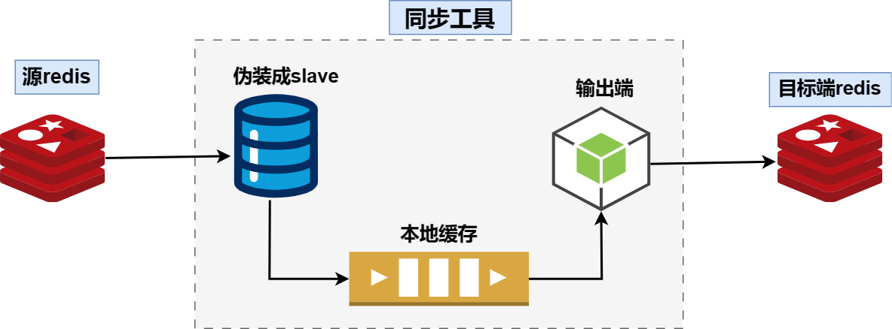

# 

[](https://github.com/mgtv-tech/redis-GunYu/actions/workflows/goci.yml)
[](https://github.com/mgtv-tech/redis-GunYu/blob/master/LICENSE)
[](https://github.com/mgtv-tech/redis-GunYu/releases)
<a href="./README_ZH.md">简体中文</a> <a href="./README_EH.md">English</a>
- [](#)
  - [Overview](#overview)
  - [Features](#features)
    - [Real-time Data Synchronization](#real-time-data-synchronization)
    - [Other Features](#other-features)
  - [Product Comparison](#product-comparison)
  - [Technical Implementation](#technical-implementation)
  - [Quick Start](#quick-start)
    - [Installation](#installation)
    - [Usage](#usage)
    - [Running the Demo](#running-the-demo)
  - [Documentation](#documentation)
  - [Contributing](#contributing)
  - [License](#license)
  - [Contact](#contact)

## Overview

`redis-GunYu` is a Redis data management tool capable of real-time data synchronization, data migration, backup, verification and recovery, data analysis, and more.

## Features

### Real-time Data Synchronization

The feature matrix of `redis-GunYu` for real-time synchronization

| Feature | Supported |
| :- | :- |
| Resuming from Breakpoints | Yes | 
| Inconsistent slots between source and target clusters | Yes | 
| Topology changes in source or target clusters (scaling, migration, etc.) | Yes | 
| High availability | Yes | 
| Data filtering | Yes | 
| Data consistency | Final/Weak | 

`redis-GunYu` has additional advantages:
- Minimal impact on stability
  - Ingest source: Specify whether to sync data from a slave, master or prefer slave
  - Local cache + resuming from breakpoints: Minimizes the impact on the source Redis
  - Splits big keys of RDB and then synchronizes them
  - Lower replication latency: Concurrent data playback while ensuring consistency, see [replication latency metrics](docs/deployment_zh.md#Monitor)
- Data security and high availability
  - Local cache supports data verification
  - High availability of the tool: Supports master-slave mode, self-election based on the latest records, automatic and manual failover; the tool is P2P architecture, minimizing downtime impact
- Fewer restrictions on Redis
  - Supports different deployment modes of Redis on the source and target, such as cluster or standalone instances
  - Compatible with different versions of Redis on the source and target, supports from Redis 4.0 to Redis 7.2, see [testing](docs/test_zh.md#Compatibility)
- More flexible data consistency strategies, automatic switching
  - When the shards distribution of the source and target is the same, batch writes in pseudo-transaction mode, and offsets are updated in real-time, maximizing consistency
  - When the shard distribution of the source and target is different, offsets are updated periodically
- User-friendly operations
  - API: supports HTTP API, such as full sync, checking synchronization status, pausing synchronization, etc.
  - Monitoring: Rich monitoring metrics, such as replication latency metrics in time and space dimensions
  - Data filtering: Filter by certain regular keys, databases, commands, etc.
  - Topology change monitoring: Real-time monitoring of topology changes in the source and target Redis (e.g., adding/removing nodes, master-slave switch, etc.), to change consistency strategies and adjust other functional strategies


### Other Features

Additional features are currently under development.

## Product Comparison

Comparison of redis-GunYu with several top-tranking tools based on product requirements

| Feature | redis-shake/v2 | DTS | xpipe | redis-GunYu |
| -- | -- | -- | -- | -- |
| Resuming from Breakpoints | Yes (no local cache) | Yes | Yes | Yes |
| Supports different sharding between source and target | No | Yes | No | Yes |
| Topology changes | No | No | No | Yes |
| High availability | No | No | Yes | Yes |
| Data consistency | Final | Weak | Weak | Final (same sharding) + Weak (different sharding) |

## Technical Implementation

The technical implementation of `redis-GunYu` is illustrated in the diagram below. For detailed technical principles, see [Technical Implementation](docs/tech.md)



## Quick Start

### Installation

You can compile it yourself or run it directly in a container

**Download Binary**

**Compile Source Code**

Make sure Go language is installed and environment variables are configured

```
git clone https://github.com/mgtv-tech/redis-gunyu.git
cd redis-GunYu

## Add proxy if needed
export GOPROXY=https://goproxy.cn,direct

make
```

This generates the `redisGunYu` binary file locally.

### Usage

**Start with configuration file**

```
./redisGunYu -conf ./config.yaml
```

**Start with command line parameters**
``` 
./redisGunYu --sync.input.redis.addresses=127.0.0.1:6379 --sync.output.redis.addresses=127.0.0.1:16379
```


**Run in docker**

```
docker run mgtvtech/redisgunyu:latest --sync.input.redis.addresses=172.10.10.10:6379 --sync.output.redis.addresses=172.10.10.11:6379


# For local testing, start the docker in host network mode --network=host, so redisGunYu can communicate with Redis
docker run --network=host mgtvtech/redisgunyu:latest --sync.input.redis.addresses=127.0.0.1:6700 --sync.output.redis.addresses=127.0.0.1:6710
```

### Running the Demo

**Start demo service**
```
docker run --rm -p 16379:16379 -p 26379:26379 -p 18001:18001 mgtvtech/redisgunyudemo:latest
```
- Source Redis: port 16379
- Target Redis: port 26379
- Synchronization tool: port 18001

**Target Redis**

```
redis-cli -p 26379
127.0.0.1:26379> monitor
```
Input `monitor` in the target Redis CLI


**Source Redis**

Connect to the source Redis and set a key. The synchronization tool will synchronize the command to the target Redis. Check the output of the target Redis connected by the Redis CLI

```
redis-cli -p 16300
127.0.0.1:16379> set a 1
```


**Check Status**
```
curl http://localhost:18001/syncer/status
```
Check the status of the synchronization tool

## Documentation

- [Configuration](docs/configuration_zh.md)
- [Deployment](docs/deployment_zh.md)
- [API](docs/API_zh.md)
- [Test Results](docs/test_zh.md)
- [Notices](docs/attentions_zh.md)

## Contributing

Everyone is welcome to help improve redis-GunYu. If you have any questions, suggestions, or want to add other features, please submit an issue or PR directly.

Please follow these steps to submit a PR:
- Clone the repository
- Create a new branch: name it `feature-xxx` for new features or `bug-xxx` for bug fixes
- Describe the changes in detail in the PR

## License

`redis-GunYu` is licensed under Apache 2.0, see [LICENSE](LICENSE).

## Contact

If you have any questions, please contact `ikenchina@gmail.com`.

