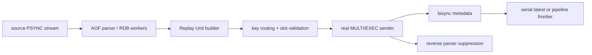

# Bisync 方案一设计与实现

- [Bisync 方案一设计与实现](#bisync-方案一设计与实现)
  - [1. 功能目的](#1-功能目的)
  - [2. 总体架构](#2-总体架构)
  - [3. 方案设计](#3-方案设计)
    - [3.1 核心设计原则](#31-核心设计原则)
    - [3.2 Replay Unit 模型](#32-replay-unit-模型)
    - [3.3 控制面 key 组织](#33-控制面-key-组织)
    - [3.4 路由与 Slot 约束](#34-路由与-slot-约束)
    - [3.5 过滤规则与事务投影](#35-过滤规则与事务投影)
    - [3.6 事务内控制数据](#36-事务内控制数据)
    - [3.7 发送链路](#37-发送链路)
    - [3.8 恢复链路](#38-恢复链路)
    - [3.9 Frontier 与 GC](#39-frontier-与-gc)
  - [4. 可观测性](#4-可观测性)
  - [5. 测试与实现](#5-测试与实现)
  - [6. 当前限制](#6-当前限制)
  - [7. 后续演进建议](#7-后续演进建议)

## 1. 功能目的

本文描述 `redis-GunYu` 当前已经落地的双向同步方案一实现。

它解决的不是“把命令再写一遍”，而是下面三个更关键的问题：

- A -> B 的镜像写入，不能再被 B -> A 当成业务写回流
- cluster 输出端必须用真实可证明的事务边界，而不是伪事务批量发送
- 重启后必须能从目标端已有控制数据中恢复出 authoritative 的 source `run_id + offset`

这里的一个前提是：cluster 双向同步当前只接受方案一主路径。

- 不再把 2A/2B 的 pending-marker 弱匹配作为 fallback
- 不再把 correctness 建立在“marker 与业务命令通常连续到达”这种经验前提上
- 如果某个 replay unit 不能证明 strict 路由、单 slot、真实事务提交，就直接 fail-stop 或走当前文档明确记载的 legacy 特例路径

方案一在当前主流程里由 `output.replay.bisyncEnabled` 显式驱动启用。

这里需要明确区分两个概念：

- 主流程里 `bisync` 是否启用：由 `bisyncEnabled` 决定
- 普通回放路径是否适合走 shard 对齐的事务批量：由 `CanTransaction` 决定

更准确地说：

- 从 `SyncerCmd -> RedisOutputConfig` 这条正式配置路径进入时，bisync 开关来自 `bisyncEnabled`
- `bisyncEnabled()` 只返回 `BisyncEnabled`

也就是说，`CanTransaction` 不再参与 bisync 开关判定。对于 cluster 双向同步，当前实现会继续走方案一的 replay unit + 真实事务发送路径，并在目标拓扑变化时处理 `MOVED` / `ASK` 重定向。

实现入口主要在：

- [syncer/output.go](../syncer/output.go)
- [syncer/bisync.go](../syncer/bisync.go)
- [syncer/bisync_rdb.go](../syncer/bisync_rdb.go)
- [pkg/redis/checkpoint/bisync.go](../pkg/redis/checkpoint/bisync.go)
- [pkg/redis/client/cluster/cluster.go](../pkg/redis/client/cluster/cluster.go)
- [pkg/redis/client/cluster/txn_batcher.go](../pkg/redis/client/cluster/txn_batcher.go)
- [pkg/redis/keyspec/keyspec.go](../pkg/redis/keyspec/keyspec.go)

## 2. 总体架构

方案一把 source replication stream 先切成 replay unit，再把每个 unit 包装成目标 Redis 上的真实 `MULTI/EXEC`。



从职责上可以拆成五层：

1. 解析层：把 AOF/RDB 输入转成 replay unit。
2. 约束层：解析业务 key，验证 strict 路由、单 slot、可投影性。
3. 提交层：把 marker、业务命令、checkpoint/journal 打包为真实事务。
4. 恢复层：启动时从 `latest` 或 `frontier + commit index + commit record` 重建起点。
5. 抑制层：反向 parser 根据事务内控制数据识别 mirrored transaction 并整批丢弃。

## 3. 方案设计

### 3.1 核心设计原则

方案一围绕五条原则展开：

1. 提交边界必须和 Redis 自身事务边界一致。
2. bisync namespace 必须独立于当前 target slot 视图、source 地址和 replid，直接复用稳定 `checkpointName`。
3. authoritative 恢复点必须来源于 deterministic key，而不是随机扫描。
4. cluster correctness 依赖真实 key 集合与单 slot 约束，不能依赖 `args[0]`。
5. full sync 的回环抑制和 authoritative 恢复边界要分开建模，不能混用。

这也意味着：方案一不是“在 2B 失败时再补一层真实事务”，而是从 replay unit、控制面、恢复面到反向抑制都直接围绕真实事务设计。

这里最重要的区分是两类控制数据：

- 抑制面：服务于 mirrored transaction 识别，例如 `marker`
- 恢复面：服务于 authoritative start point 恢复，例如 `latest`、`frontier`、`commit index`、`commit record`

这两个面经常在一个事务里一起写，但它们的职责不同，文档后续也按这个区分展开。

### 3.2 Replay Unit 模型

`bisyncReplayUnit` 定义在 [syncer/bisync.go](../syncer/bisync.go)。

核心字段包括：

- `Seq`
- `StartOffset`
- `EndOffset`
- `Slot`
- `SlotTag`
- `Digest`
- `SourceTxn`
- `Commands`

含义是：

- `Seq`：source stream 上的全局单调序号，不按 slot 分配
- `StartOffset/EndOffset`：该 unit 在 source replication stream 上覆盖的边界
- `Slot/SlotTag`：该 unit 绑定的目标 slot-local 控制维度
- `Digest`：对业务命令序列计算的稳定摘要
- `SourceTxn`：该 unit 是否来自源端真实 `MULTI ... EXEC`

切分规则如下：

- 普通命令：一条命令就是一个 replay unit
- 源端 `MULTI ... EXEC`：整个事务是一个 replay unit
- `PING`、`SELECT`、checkpoint 命名空间控制命令不会进入 replay unit
- 已被识别为 mirrored transaction 的 `MULTI ... EXEC` 会整批抑制

cluster 与 standalone 的差别体现在 slot 模型上：

- cluster：每个 unit 必须能证明全部业务 key 落在同一 slot
- standalone：强制使用 synthetic slot `0`，允许事务内业务 key 分布在任意真实 slot

这就是为什么 standalone 下也保留 `Slot`、`SlotTag` 字段。方案一内部始终需要一套统一的 slot-local 控制维度。

RDB 路径的 replay unit 与 AOF 略有不同：

- 单 key entry：一个 key 一个 unit
- split key：每个 bin 一个 unit，但所有 bin 会被分发到同一个 worker
- `StartOffset == EndOffset == fullSyncOffset`

这里的 `fullSyncOffset` 只是“这份 RDB 属于哪个 full-sync barrier”的标签，不表示 key 级 authoritative 恢复点。

### 3.3 控制面 key 组织

这是方案一最容易遗漏、但最关键的设计维度。

#### 3.3.1 稳定 `checkpointName` root

当前实现不再把 `laneID` 作为 bisync namespace 身份，而是直接复用稳定 `checkpointName`。

启动流程位于 [syncer/syncer.go](../syncer/syncer.go)：

1. 先用 source 当前 `runId/replid2` 查询 `redis-gunyu-checkpoint-hash`
2. 若命中，则直接复用已有 `checkpointName`
3. 若未命中，则创建新的稳定 root，格式类似 `redis-gunyu-checkpoint-bisync:<stable-id>`
4. 再把 `runId -> checkpointName` 写回 `checkpoint-hash`

这里的关键点是：

- `runId/replid` 只负责索引 `checkpointName`
- bisync namespace 本身直接由 `checkpointName` 决定
- `checkpointName` 不依赖 target 当前 slot 分布、source 地址或 source 当前 replid
- 因此 target failover / reshard、source 地址漂移都不会导致 bisync namespace 改名

#### 3.3.2 三层 key 组织

当前实现实际使用三层 key 组织：

1. 传统 checkpoint root
   例如 `checkpointName`
   由 [syncer/output.go](../syncer/output.go) 的 `setCheckpoint` 维护，描述 full sync barrier 或 legacy 恢复点。

2. bisync namespace-global key
   例如 `checkpointName:frontier`
   这是 pipeline 模式下的全局连续前缀快照。

3. bisync slot-local key
   以 `redis-gunyu-bisync:<checkpointName>:` 为前缀，控制 key 与业务 key 通过 `{slotTag}` 强制落在同一 slot。

#### 3.3.3 slotTag

`slotTag = BisyncSlotTag(slot)`，其目标是构造一个 `{slotTag}`，使 Redis cluster hash 后一定落在指定 slot。

这样所有 slot-local 控制 key 都满足两个条件：

- deterministic：恢复时不需要 `KEYS`
- colocated：与该 unit 的业务 key 保证在同一 slot，可进同一个 `MULTI/EXEC`

standalone 场景固定：

- `slot = 0`
- `slotTag = BisyncSlotTag(0)`

#### 3.3.4 key 一览

| key | 作用域 | 作用 | authoritative |
| --- | --- | --- | --- |
| `checkpointName` | 全局 | full sync 完成后推进普通 checkpoint | 是 |
| `checkpointName:frontier` | namespace-global | pipeline 模式连续前缀快照 | 是 |
| `redis-gunyu-bisync:<checkpointName>:marker:{slotTag}` | slot-local | mirrored transaction 抑制入口 | 否 |
| `redis-gunyu-bisync:<checkpointName>:latest:{slotTag}` | slot-local | serial 模式每 slot 最新已提交点 | 是 |
| `redis-gunyu-bisync:<checkpointName>:index:{slotTag}` | slot-local | pipeline 模式 commit record 索引 | 否，本身只是索引 |
| `redis-gunyu-bisync:<checkpointName>:commit:{slotTag}:<unitSeq>` | slot-local | pipeline 模式 journal record | 是，与 frontier 联合使用 |

这里有两个刻意设计：

- `frontier` 不放进 `redis-gunyu-bisync:` 前缀下，而是直接挂在 `checkpointName` 下，因为它本质上是恢复面上的 namespace-global 快照。
- `marker/latest/commit/index` 必须 slot-local，因为它们要与业务写入在同一个 `MULTI/EXEC` 内提交；同时 key 名又必须只依赖稳定 `checkpointName + slotTag`，不能依赖当前拓扑。

### 3.4 路由与 Slot 约束

方案一 correctness 建立在“命令真实 key 集合可解析”这个前提上。

共享 key spec 在 [pkg/redis/keyspec/keyspec.go](../pkg/redis/keyspec/keyspec.go)，同时被三处复用：

- `pkg/filter`
- `syncer/bisync.go`
- `pkg/redis/client/cluster`

这保证过滤、replay-unit 构建、cluster 路由看到的是同一套 key 规则。

key 解析流程是：

1. 优先使用静态 `keyspec.CommandKeys`
2. 静态表未命中时，回退到目标 Redis 的 `COMMAND GETKEYS`
3. 仍无法解析时，strict 路径直接 fail-stop

对应实现：

- [syncer/bisync.go](../syncer/bisync.go) 的 `resolveBisyncCommandKeys`
- [pkg/redis/client/cluster/cluster.go](../pkg/redis/client/cluster/cluster.go) 的 `ChooseNodeWithCmdStrict`

约束要求如下：

- cluster：所有业务 key 必须能解析，且必须同 slot、同 node
- standalone：不要求单 slot，但仍要求命令可解析出真实 key 集合

因此方案一不是“尽量路由”，而是“能证明才发送”。

### 3.5 过滤规则与事务投影

过滤发生在 parser 阶段，先于 replay unit 构建。

沿用已有过滤能力：

- `cmd blacklist`
- `db blacklist`
- key 前缀白黑名单
- slot 白黑名单

与旧逻辑相比，方案一补上的关键点是“事务内部分投影”：

- 若事务里某些 key 被过滤，不再一律 fail-stop
- 但只允许对语义可证明安全的命令做 partial projection

当前允许部分投影的命令只有：

- `MSET`
- `DEL`
- `UNLINK`

其余会因删掉部分 key 改变语义的 multi-key 命令，例如：

- `MSETNX`
- `RENAME`
- `COPY`
- `ZUNIONSTORE`

都会整体丢弃该命令或该事务中的该命令投影结果。

实现位于：

- [pkg/filter/filter.go](../pkg/filter/filter.go)
- [pkg/redis/keyspec/keyspec.go](../pkg/redis/keyspec/keyspec.go)

### 3.6 事务内控制数据

#### 3.6.1 Marker

`BisyncMarker` 包含：

- `record_type`
- `version`
- `run_id`
- `syncer_id`
- `unit_seq`
- `start_offset`
- `end_offset`
- `slot`
- `digest`

marker 通过 `SET ... PX` 写入，TTL 当前固定为 24 小时。

它的职责是：

- 让反向 parser 能在事务开始处快速识别“这是一笔镜像回放事务”
- 为事务尾部 record 的一致性校验提供主键字段

#### 3.6.2 Commit Record / Latest Record

`BisyncCommitRecord` 包含：

- `record_type`
- `version`
- `run_id`
- `syncer_id`
- `unit_seq`
- `start_offset`
- `end_offset`
- `slot`
- `digest`
- `mtime`

serial 模式把它写成 `latest`：

- 每个 slot 只有一个 deterministic key
- 覆盖式更新

pipeline 模式把它写成 `commit`：

- 每个 unit 一个 `commit record`
- 同时写入 slot-local `index zset`
- frontier coordinator 再把连续闭合前缀持久化为 `frontier`

#### 3.6.3 事务内控制数据排列

AOF replay unit 在目标端的提交协议如下：

```redis
MULTI
SET  <marker-key> <marker-json> PX <ttl>
... business commands ...
HSET <latest-or-commit-key> ...
ZADD <commit-index> <unitSeq> <commit-key>   # 仅 pipeline=true
EXEC
```

这个排列有两个目的：

- mirrored transaction 识别时，事务首尾都能看到控制数据
- authoritative 恢复点只在业务写已经进入同一个 `EXEC` 的前提下推进

#### 3.6.4 RDB 事务内控制数据

RDB 路径当前只要求“full sync 写入也能被反向识别”，不要求 key 级 authoritative 恢复。

因此当前实现是：

```redis
MULTI
SET <marker-key> <marker-json> PX <ttl>
... business commands ...
EXEC
```

其中 `marker.record_type = "rdb"`。

反向 parser 在识别到：

- 第一条控制命令是合法 `marker`
- 且 `record_type == "rdb"`
- 且事务内存在业务命令

就会把整批事务视为 mirrored RDB transaction 并抑制。

这意味着：

- RDB 路径当前依赖 marker 抑制，不依赖 `latest/frontier/commit`
- RDB replay unit 的 `offset` 只是 full-sync barrier 标签，不是 key 级恢复点

### 3.7 发送链路

#### 3.7.1 AOF 解析与镜像抑制

`parseAofReplayUnits` 的处理顺序是：

1. 解析 RESP 命令流
2. 执行 db/cmd/key/slot 过滤
3. 遇到 `MULTI ... EXEC` 时按事务缓存
4. 在 `EXEC` 处判断是否为 mirrored transaction
5. 非镜像事务才构建 replay unit

镜像识别逻辑在 [syncer/bisync.go](../syncer/bisync.go) 的 `isBisyncMirroredTransaction`。

它不再使用旧的 pending-marker 状态机，而是按事务边界做判定：

- 第一条控制命令必须是合法 marker
- 如果事务尾部有 `latest/commit` record，则要求 `run_id/syncer_id/unit_seq/offset/slot/digest` 一致
- 如果是 `record_type=rdb`，当前实现按 marker 直接识别

#### 3.7.2 `pipeline=false` 串行模式

串行模式的性质最简单：

- 任意时刻只允许一个 in-flight replay unit
- 一个 unit `EXEC` 成功后，才发送下一个 unit
- 事务内写 `marker + business + latest`

所以已提交集合天然构成 source stream 的连续前缀。

恢复时只需：

1. cluster 下固定枚举 `0..16383` 全部 slot；standalone 只看 synthetic slot `0`
2. 读取这些 slot 上 `checkpointName` 命名空间里的 deterministic `latest`
3. 取 `EndOffset` 最大的记录作为 authoritative 起点

#### 3.7.3 `pipeline=true` 并发模式

并发模式下不能再简单看“最大 offset”，因为不同 slot 的提交可能交错。

当前实现采用三段式：

- dispatch 连接：持续把 replay unit 编码为真实事务并发送
- receive goroutine：异步等待各个事务的 `EXEC` reply
- frontier coordinator：只在 `[1..N]` 连续闭合时推进全局 frontier

事务内写入的是：

- `marker`
- `business commands`
- `commit record`
- `commit index`

`frontier` 不在事务内写，而是由 coordinator 在收到连续 commit 后单独持久化。

这样做的原因是：

- 事务提交是 slot-local 的
- frontier 是 `checkpointName`-global 的连续前缀视图
- namespace-global 状态必须由单个 coordinator 汇总，不适合进每个 slot-local `EXEC`

#### 3.7.4 RDB 发送链路

RDB 路径复用现有 `ReplayRdbParallel` worker 模型，但在 worker 内改成 bisync 事务发送。

当前实现特点：

- dispatcher 继续按 key hash 分发任务
- split key 的所有 bin 落到同一 worker
- worker 本地维护 `skipKey` 状态，用于 `keyExists=ignore`
- cluster 下无法绑定业务 key 的全局 opcode，例如 `FUNCTION RESTORE`，仍走 legacy 直放

RDB 发送时分两条路径：

- 满足 `bisyncRdbUseRestore` 时，直接生成 `RESTORE` 或 `RESTORE REPLACE`
- 否则把对象展开成确定性的命令序列再发送

无论走哪条路径，`keyExists` 语义都在事务发送前被明确决定：

- `replace`
  如果走展开路径，则第一 bin prepend `DEL key`；如果走 restore 路径，则直接使用 `RESTORE REPLACE`
- `ignore`
  第一 bin 先 `EXISTS`，命中后整 key 后续 bin 全跳过
- `error`
  第一 bin 先 `EXISTS`，命中即 fail-stop

这样 busykey 语义不会退化成 `EXEC` 之后的补发补救动作。

#### 3.7.5 目标拓扑变化处理

方案一虽然不再依赖 `CanTransaction=true`，但仍然要求目标端提交边界是“单 slot、单 node、真实事务”。

当前 cluster 事务 batcher 对目标拓扑变化的处理是：

- `MOVED`
  刷新拓扑，解析重定向节点，按新的目标 node 重发整个事务 unit
- `ASK`
  切到临时目标节点，先发送 `ASKING`，再重发整个事务 unit
- 连续重定向超过阈值
  直接 fail-stop，避免在不稳定拓扑上无限重试

这保证了两个性质：

- bisync 不会因为普通回放路径的 `CanTransaction` 判定变化而被静默关闭
- cluster 扩容、缩容、slot 迁移期间，只要 Redis 仍能给出 `MOVED/ASK` 正确重定向，事务 unit 仍可在新目标上重试提交

这里的重试单位始终是整个 replay unit，而不是退回到旧的 marker + 单命令弱匹配模型。

### 3.8 恢复链路

#### 3.8.1 启动入口

启动恢复入口在 [syncer/bisync.go](../syncer/bisync.go) 的 `scheme1StartPoint`。

它返回四项：

- `StartPoint`
- `lastSeq`
- `ok`
- `error`

其中 `StartPoint` 仍然是传统意义上的 source `run_id + offset`。

在进入 `scheme1StartPoint` 之前，[syncer/syncer.go](../syncer/syncer.go) 已先通过 `checkpoint-hash` 解析或创建稳定 `checkpointName`。因此后续恢复逻辑不再根据当前 output shard 的 slot 视图推导 namespace，而是直接围绕这个稳定 root 读取历史状态。

#### 3.8.2 serial 模式恢复

serial 模式直接读取 `latest`：

1. cluster 下直接枚举 `0..16383` 全部 slot；standalone 只看 synthetic slot `0`
2. 对每个 slot 读取 `checkpointName` 命名空间里的 `latest`
3. 过滤掉 runID 不匹配的记录
4. 取 `EndOffset` 最大、`mtime` 最新的记录

之所以可以取最大 offset，是因为 serial 模式保证全局单 in-flight，已提交集合本来就是连续前缀。

#### 3.8.3 pipeline 模式恢复

pipeline 模式恢复必须重建连续前缀：

1. 读取 `checkpointName:frontier`
2. 用 `snapshot.UnitSeq + 1` 作为 `minSeq`
3. cluster 下直接枚举 `0..16383` 全部 slot；standalone 只看 synthetic slot `0`
4. 从每个 slot 的 deterministic `index` 中 `ZRANGEBYSCORE minSeq +inf`
5. 根据 index member 定位 `commit record`
6. 用 `RebuildBisyncFrontier` 从 snapshot 之后继续闭合
7. 闭合完成后的 `frontier.run_id + frontier.offset + frontier.unit_seq` 就是 authoritative 起点

这个过程有三个关键点：

- 不使用 `KEYS`
- snapshot 只是加速缓存，不是唯一真相
- 恢复阶段不依赖当前 output shard 的 slot 视图；target reshard / failover 后仍按稳定 namespace 读取旧状态
- authoritative 恢复点是“连续闭合前缀终点”，不是“某个 slot 上最大的 offset”

#### 3.8.4 RDB 恢复边界

RDB 路径故意不参与 `scheme1StartPoint` 的 `latest/frontier/commit` 重建。

原因是当前 full sync 仍然允许多 worker 并发：

- 某些 key 已经提交，不等于整份 RDB 已完成
- 如果把这些 key 级提交误当成 authoritative checkpoint，就会把“半份 RDB”误判成“可以继续增量”

因此当前边界是：

1. RDB 期间只负责 mirrored transaction 抑制
2. 所有 RDB worker drain 成功后，才调用普通 `setCheckpoint(runID, fullSyncOffset)`
3. 后续 AOF replay 再通过 `latest/frontier` 推进更细粒度恢复点

换句话说：

- RDB 解决的是“回环抑制”
- `checkpointName` 解决的是“full sync barrier”
- `latest/frontier` 解决的是“AOF authoritative resume”

### 3.9 Frontier 与 GC

pipeline 模式下，`bisyncFrontierCoordinator` 维护：

- 当前 frontier 的 `UnitSeq`
- 当前 frontier 的 `Offset`
- 尚未闭合的 `pending[unitSeq]`

推进规则是：

1. 某个 `commit record` 已确认提交
2. 放入 `pending`
3. 从 `frontier.UnitSeq + 1` 开始尽可能向前闭合
4. 若闭合成功，则持久化 `frontier snapshot`
5. 删除已越过 frontier 的 `commit record`
6. 同时从对应 slot 的 `commit index` 中 `ZREM` 掉 member

GC 后仍然保留的状态只有：

- 最新的 `frontier snapshot`
- 尚未闭合的 `commit record/index`

因此 journal 不会随着运行时间无限增长。

## 4. 可观测性

当前实现已补充的核心指标主要在 [syncer/bisync.go](../syncer/bisync.go) 和 [syncer/output.go](../syncer/output.go)。

重点包括：

- `bisync_unit_build`
  replay unit 构建成功/失败
- `bisync_txn_commit`
  事务提交成功/失败
- `bisync_single_slot_fail`
  single-slot 校验失败次数
- `bisync_txn_suppress`
  mirrored transaction 抑制情况
- `bisync_frontier_seq`
  当前连续前缀序号
- `bisync_frontier_offset`
  当前连续前缀 offset
- `bisync_frontier_rebuild_seconds`
  启动恢复重建 frontier 耗时
- `bisync_commit_backlog`
  待闭合 commit 积压量
- `bisync_commit_gc`
  frontier 推进后被 GC 的 commit 数量
- `send_offset` / `ack_offset`
  发送与确认偏移
- `sync_delay`
  端到端同步延迟

除指标外，日志也会打印：

- checkpointName、slot 数、snapshot、journal 数量
- serial / pipeline 选中的 start point
- frontier rebuild 结果
- strict 路由与事务提交错误

## 5. 测试与实现

### 5.1 实现拆分

当前代码职责分布如下：

- [syncer/bisync.go](../syncer/bisync.go)
  AOF replay unit、镜像抑制、真实事务发送、frontier 协调、启动恢复
- [syncer/bisync_rdb.go](../syncer/bisync_rdb.go)
  RDB replay unit、`keyExists` 确定性投影、RDB bisync 事务发送
- [pkg/redis/checkpoint/bisync.go](../pkg/redis/checkpoint/bisync.go)
  bisync key 编码、record/frontier 编解码、frontier rebuild、latest/journal 读取
- [pkg/redis/client/cluster/cluster.go](../pkg/redis/client/cluster/cluster.go)
  strict 路由、`COMMAND GETKEYS` 回退、`MOVED/ASK` 重定向解析
- [pkg/redis/client/cluster/txn_batcher.go](../pkg/redis/client/cluster/txn_batcher.go)
  cluster 真实事务 batcher、`ASKING`/重定向重试
- [pkg/filter/filter.go](../pkg/filter/filter.go)
  过滤与部分投影

### 5.2 单元测试覆盖

当前已有的重点单测包括：

- replay unit 构建
- cluster cross-slot fail
- standalone synthetic slot 接受跨 slot 事务
- AOF mirrored transaction 抑制
- mirrored RDB transaction 抑制
- RDB `replace/ignore/error` 三种 `keyExists` 语义
- split key 的 worker-local `skipKey`
- strict 路由与 `COMMAND GETKEYS` 回退
- filtered transaction projection
- frontier rebuild
- checkpointName 直接作为 bisync namespace root / frontier key
- cluster 恢复默认扫描全 `16384` slot
- bisync 在 `CanTransaction=false` 时仍保持启用
- cluster 事务 batcher 对 `MOVED/ASK` 的重试

对应文件：

- [syncer/bisync_test.go](../syncer/bisync_test.go)
- [syncer/bisync_rdb_test.go](../syncer/bisync_rdb_test.go)
- [pkg/redis/checkpoint/bisync_test.go](../pkg/redis/checkpoint/bisync_test.go)
- [pkg/redis/client/cluster/route_test.go](../pkg/redis/client/cluster/route_test.go)
- [pkg/redis/client/cluster/redirect_test.go](../pkg/redis/client/cluster/redirect_test.go)
- [pkg/filter/filter_test.go](../pkg/filter/filter_test.go)

### 5.3 集成测试

`tests/bisync` 已经把方案一拆成多类可执行脚本：

- [tests/bisync/run_category1.sh](../tests/bisync/run_category1.sh)
  基础双向同步收敛
- [tests/bisync/run_category2.sh](../tests/bisync/run_category2.sh)
  serial / pipeline 重启恢复
- [tests/bisync/run_category3.sh](../tests/bisync/run_category3.sh)
  RDB 特殊路径与 full-sync barrier
- [tests/bisync/run_category4.sh](../tests/bisync/run_category4.sh)
  filter、keyspec、strict routing；支持切到更高版本 Redis 或带模块的实例持续跑 `keyspec_verify`
- [tests/bisync/run_category5.sh](../tests/bisync/run_category5.sh)
  故障注入、failover、拓扑扰动

测试说明见：

- [tests/bisync/README.md](../tests/bisync/README.md)

## 6. 当前限制

当前实现仍然有以下边界：

1. scheme1 correctness 依赖“真实 key 集合可解析”
   如果静态 key spec 未命中，且 `COMMAND GETKEYS` 也无法给出可证明的结果，strict 路径会直接 fail-stop。

2. 部分投影是受限能力
   当前只对 `MSET/DEL/UNLINK` 放开 partial projection，其余 multi-key 命令仍然保守处理。

3. RDB 路径当前只解决 mirrored transaction 抑制
   它不提供 key 级 authoritative 恢复点，恢复仍以整份 RDB 完成后的普通 checkpoint 作为 barrier。

4. cluster 下非 key-based 全局 opcode 仍存在 legacy 回退
   例如 `FUNCTION RESTORE` 这类无法绑定到 slot-local 控制 key 的命令，当前不能完全纳入 scheme1 strict 事务模型。

5. pipeline 恢复对 journal 异常仍有继续收紧空间
   当前 `RebuildBisyncFrontier` 已能发现 gap，但 snapshot/journal 更复杂的不一致判定仍可加强。

6. pipeline 重建当前只能跳过“连续已提交前缀”，还不能跳过 `frontier` 之后所有已提交 unit
   当前恢复入口会先读取 `frontier snapshot`，再加载 `frontier.UnitSeq + 1` 之后的 `commit journal`，并通过 `RebuildBisyncFrontier` 只把“从 frontier 之后继续连续闭合”的部分推进为 authoritative start point。若崩溃时存在 gap，则 gap 后面那些其实已经 durable commit、但尚未被连续闭合进 frontier 的 unit，重启后仍会跟随 source stream 再次重放。也就是说，当前语义是“从最后连续已提交点之后恢复”，还不是“精确跳过所有已提交、只回放未提交 unit”。

7. cluster 拓扑剧烈抖动时仍以 fail-stop 为主
   当前实现已经支持 `MOVED/ASK` 下的事务级重试，但如果目标端持续重定向或长时间不稳定，系统仍会选择中断而不是退回 2B/best-effort。

8. 模块命令兼容性尚未闭环
   当前对 RedisJSON / RedisBloom 模块命令仍按“暂时不支持”管理，具体包括 `JSON.SET`、`JSON.DEL`、`JSON.MSET`、`BF.ADD`、`CMS.MERGE`、`TDIGEST.MERGE`、`TOPK.ADD`。这些命令尚未纳入稳定的模块实例验证矩阵和发布门禁；当目标 Redis 未加载对应模块时，`COMMAND GETKEYS` 无法给出可证明的 key 集合，strict 路径会直接 fail-stop。

## 7. 后续演进建议

优先级建议如下：

1. 继续补齐和校验 key spec
   现在 `run_category4.sh` / `keyspec_verify` 已支持通过自定义 Redis 二进制、`loadmodule` 参数、外部地址和附加样本文件持续校验；后续重点转为把新版本/模块命令持续纳入样本集，进一步减少 strict 路由对目标 Redis `COMMAND GETKEYS` 能力的依赖。

2. 补齐模块命令支持闭环
   优先把 RedisJSON / RedisBloom 的模块实例接入常态化验证，逐步解除当前“暂时不支持”的命令清单：`JSON.SET`、`JSON.DEL`、`JSON.MSET`、`BF.ADD`、`CMS.MERGE`、`TDIGEST.MERGE`、`TOPK.ADD`。在模块实例、keyspec 校验、strict routing 和回归门禁都稳定之前，继续按待优化项管理。

3. 加强 pipeline 恢复异常检测
   对 snapshot 回退、journal 缺口、跨 runID 混入等场景给出更明确的 fail-stop。

4. 让 pipeline 重建能够精确跳过已提交 unit
   启动时除了重建 `frontier`，还应把 `frontier` 之后残留的已提交 `commit journal` 装载为恢复期 `pending/committed` 视图；后续 parser 重新生成 replay unit 时，若 `unit_seq + run_id + offset range + slot + digest` 与已 durable commit 的 journal 精确匹配，则直接跳过发送，仅对真正未提交或无法证明已提交的 unit 继续回放。这样才能把恢复语义从“连续前缀恢复”进一步收紧到“只回放未提交 unit”。

5. 优化 replay unit 粒度与并发模型
   当前 replay unit 仍偏向“单条命令一个 unit”或“源端事务一个 unit”的保守切分。后续可以把同一 slot、且可证明顺序安全的一组 key 写合并到同一个 unit 内提交；不同 slot 的 unit 则继续并发执行。这样可以减少事务与控制面开销，同时保持 slot 内顺序和跨 slot 并发这两个核心约束不变。

6. 补充 key spec fallback 可观测性
   单独统计哪些命令走了 `COMMAND GETKEYS`，哪些命令仍 unresolved，便于压测和线上收敛。

7. 继续收敛 RDB 与 AOF 控制面模型
   如果后续要把 full sync 也纳入更强的恢复语义，需要先解决“多 worker 并发回放”和“全局 barrier”之间的建模问题。

8. 评估非 key-based RDB opcode 的闭环方案
   让 cluster 下的全局对象恢复也能进入可抑制、可验证的 bisync 控制面。
