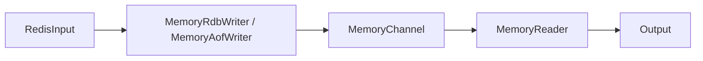

# Memory Channel 实现说明

- [Memory Channel 实现说明](#memory-channel-实现说明)
  - [1. 背景与目标](#1-背景与目标)
  - [2. 对外接口与接入方式](#2-对外接口与接入方式)
  - [3. 整体结构](#3-整体结构)
  - [4. 核心数据模型](#4-核心数据模型)
  - [5. 写入流程](#5-写入流程)
    - [5.1 RDB 写入](#51-rdb-写入)
    - [5.2 AOF 写入](#52-aof-写入)
  - [6. 读取流程](#6-读取流程)
  - [7. 容量控制与回收](#7-容量控制与回收)
  - [8. runId 与起点语义](#8-runid-与起点语义)
  - [9. 并发与关闭语义](#9-并发与关闭语义)
  - [10. 配置项语义](#10-配置项语义)
  - [11. 测试与验证](#11-测试与验证)
  - [12. 当前限制](#12-当前限制)

## 1. 背景与目标

`redis-GunYu` 原来的 channel 后端是 `storer`，即把本地 RDB/AOF 缓存写入磁盘。

为了减少磁盘 I/O、降低本地落盘开销，新增了 `memory channel`。它保留了原有 `Channel` 抽象，不改动 `input -> channel -> output` 主流程，只把 channel 后端从文件系统替换为纯内存实现。

目标有三点：

- 对上层同步流程透明，复用现有 `Channel` 接口。
- 同时支持 full sync 的 RDB 和 incremental sync 的 AOF。
- 在设置 `maxSize` 后，内存占用受到硬上限约束，而不是无限增长。

实现入口：

- [syncer/channel.go](../syncer/channel.go)
- [syncer/memory_channel.go](../syncer/memory_channel.go)
- [syncer/input.go](../syncer/input.go)
- [syncer/memory_channel_test.go](../syncer/memory_channel_test.go)

## 2. 对外接口与接入方式

`memory channel` 没有引入新的上层协议，而是实现了现有 `Channel` 接口：

```go
type Channel interface {
	StartPoint([]string) (StartPoint, error)
	SetRunId(string) error
	DelRunId(string) error
	RunId() string
	IsValidOffset(Offset) bool
	GetOffsetRange(string) (int64, int64)
	GetRdb(string) (int64, int64)
	NewRdbWriter(io.Reader, int64, int64) (RdbChannelWriter, error)
	NewAofWritter(r io.Reader, offset int64) (AofChannelWriter, error)
	NewReader(Offset) (ChannelReader, error)
	Close() error
}
```

`syncer/channel.go` 中通过 `channel.type` 选择后端：

- `storer`：原来的磁盘缓存实现
- `memory`：新的内存缓存实现

对应代码位于 [syncer/channel.go](../syncer/channel.go) 的 `NewChannel`。

因此对 `RedisInput`、`Output`、复制拓扑和断点续传逻辑来说，`memory channel` 只是一个新的 `Channel` backend。

## 3. 整体结构

主链路没有变化，仍然是：

```text
source redis
  -> RedisInput PSYNC
  -> Channel writer
  -> Channel reader
  -> Output replay
```

其中内存实现替代的是中间这段本地缓存。



`RedisInput` 的接入点在 [syncer/input.go](../syncer/input.go)：

1. full sync 时调用 `channel.NewRdbWriter(...)`
2. incr sync 时调用 `channel.NewAofWritter(...)`
3. output 侧回放时调用 `channel.NewReader(...)`

也就是说，memory channel 只负责两件事：

- 把输入流持续写入内存缓存
- 从给定 offset 开始把缓存重新读出来

## 4. 核心数据模型

核心结构在 [syncer/memory_channel.go](../syncer/memory_channel.go)。

### 4.1 `MemoryChannel`

`MemoryChannel` 维护整个内存缓存状态：

- `runId`：当前缓存所属 replication id
- `maxSize`：总内存上限
- `logSize`：逻辑分段大小
- `totalSize`：当前已缓存的总字节数
- `rdb`：当前 full sync 的 RDB 缓存
- `aofSegs`：AOF 分段列表
- `aofWriter`：当前活动中的 AOF writer
- `spaceNotify`：空间释放通知，用于写入阻塞与唤醒

其中最关键的是：RDB 和 AOF 都不是一个连续大 buffer，而是按 segment 组织。

### 4.2 `memorySegment`

`memorySegment` 表示一个逻辑分段，包含：

- `left`：该段对应的起始 offset
- `blob`：实际字节内容
- `next`：RDB 读取时串联下一个 segment
- `readers`：当前正在读取该 segment 的 reader 数量

这样做有两个目的：

- 避免单个超大切片持续扩容
- 为后续 GC 提供更小粒度的回收单位

### 4.3 `appendBlob`

`appendBlob` 是 segment 内部真正存数据的对象，职责很简单：

- `append(buf)`：追加写
- `readAt(off, buf, done)`：按偏移读取
- `close(err)`：关闭并唤醒等待中的 reader

它通过 `notify chan struct{}` 实现“写入方追加数据后通知读取方继续读”的机制，所以读取端不需要忙等。

### 4.4 `memoryRdb`

RDB 由 `memoryRdb` 表示：

- `left`：RDB 对应的复制偏移起点
- `size`：RDB 总大小
- `replayable`：该 RDB 是否还能作为恢复输入重新回放
- `segments`：RDB 分段列表

这里的 `replayable` 很重要。若 RDB 的早期分段已经因为容量压力被 GC 掉，即便后面还残留部分 segment，也不能再把它当成一份完整 RDB 给 reader。

## 5. 写入流程

## 5.1 RDB 写入

RDB 写入从 `RedisInput.syncData` 开始，在 full sync 场景下调用：

```go
rdbWriter, err = ri.channel.NewRdbWriter(redisCli.Client().BufioReader(), offset, rdbSize)
```

随后 `writer.Start()` 启动后台写入协程，`writer.Wait(ctx)` 等待结束。

`MemoryChannel.NewRdbWriter(...)` 的行为是：

1. 调用 `resetDataLocked(io.EOF)` 清空旧数据
2. 创建新的 `memoryRdb`
3. 返回 `MemoryRdbWriter`

`MemoryRdbWriter.ingest()` 循环从上游 reader 中读取数据，并调用 `appendRdb(...)` 写入内存。

`appendRdb(...)` 的关键逻辑：

1. 校验当前 writer 仍然是有效 writer
2. 取当前 segment
3. 若当前 segment 已达到 `logSize`，则创建下一个 segment
4. 调用 `ensureCapacityLocked(space, done)` 保证写入前有足够空间
5. 实际追加到 `segment.blob`
6. 增加 `totalSize`

当 RDB 写入结束后，`finishRdb(...)` 会关闭当前 segment。若写入失败，还会回收这次 RDB 已占用的内存，并把 `mc.rdb` 置空。

## 5.2 AOF 写入

AOF 写入路径与 RDB 类似，但它是持续流式写入，没有预先给定总大小。

创建入口：

```go
aofWriter, err = ri.channel.NewAofWritter(redisCli.Client().BufioReader(), offset)
```

`MemoryChannel.NewAofWritter(...)` 的行为：

1. 若已有旧的 `aofWriter`，先关闭它
2. 以当前 offset 新建一个 segment
3. 把该 segment 追加到 `aofSegs`
4. 返回新的 `MemoryAofWriter`

`MemoryAofWriter.ingest()` 持续从复制流读取数据，并调用 `appendAof(...)` 写入。

`appendAof(...)` 与 `appendRdb(...)` 的差异主要在于：

- 新 segment 会直接追加到 `mc.aofSegs`
- writer 的 `offset` 会随着成功写入不断推进
- `Right()` 返回当前已经写到的最新 offset，供 `PSYNC ACK` 使用

`RedisInput.startSyncAck(...)` 会定期读取 `writer.Right()`，向源端发送 ACK。这意味着 memory channel 不只是缓存层，也参与了复制位点推进。

## 6. 读取流程

读取入口在 `MemoryChannel.NewReader(offset Offset)`。

这个方法会先判断请求 offset 是否仍在当前缓存范围内：

- 若不在范围内，返回 `os.ErrNotExist`
- 若命中 AOF 区间，则走 AOF reader
- 若没有命中 AOF，但存在可回放 RDB 且 offset 不晚于 RDB 起点，则走 RDB reader

### 6.1 读 RDB

RDB reader 的构造条件是：

- `mc.rdb != nil`
- `mc.rdb.replayable == true`
- `offset.Offset <= mc.rdb.left`

随后 `copyRdbFrom(...)` 会按 segment 顺序把整份 RDB 输出到 pipe。

这里有一个实现细节：RDB segment 的 `left` 不是 replication offset，而是“RDB 内部已缓存字节位置”。因此 `copyRdbFrom(...)` 使用 `readBytes` 作为相对位置在各 segment 间推进。

### 6.2 读 AOF

AOF reader 通过 `indexAofLocked(offset)` 找到 offset 所在 segment，再由 `copyAofFrom(...)` 开始流式输出。

`copyAofFrom(...)` 的读取逻辑是：

1. 从当前 segment 的相对位置开始读
2. 如果该段还有数据，就继续写到 pipe
3. 如果读到 `io.EOF`，说明当前 segment 已关闭且读完
4. 通过 `nextAofSegment(...)` 找到下一个 segment，继续读

由于 `appendBlob.readAt(...)` 会在“数据暂时还没写到”时阻塞等待通知，因此 AOF reader 可以边读边追写入中的 segment，而不需要一次性缓存完整 AOF。

### 6.3 `MemoryReader`

无论 RDB 还是 AOF，最终都封装成 `MemoryReader` 返回给上层。

`MemoryReader` 内部使用 `pipeio.NewSize(...)` 创建一对 pipe：

- 后台协程执行 `copyFunc`
- 读取端从 `IoReader()` 返回的 `bufio.Reader` 消费数据

这样做的好处是：

- 对 `Output.Send(...)` 保持原有 reader 接口不变
- channel 内部可以异步把 segment 数据拼接成连续字节流

## 7. 容量控制与回收

这是 memory channel 最核心的部分。

### 7.1 硬上限保证

写入前会调用 `ensureCapacityLocked(need, done)`：

1. 若 `totalSize + need <= maxSize`，直接写
2. 否则先尝试 `gcLocked(need)`
3. 如果回收后仍然放不下，则等待 `spaceNotify`
4. 等到有空间释放后重试

因此 `maxSize` 是真正的硬上限，而不是一个“尽量控制”的软阈值。

### 7.2 GC 策略

`gcLocked(need)` 当前只会回收“已经关闭且没有 reader 引用”的最老 segment。

回收顺序是：

1. 优先回收最老的 AOF segment
2. 再尝试回收最老的 RDB segment

回收条件：

- segment 已 `close`
- `readers == 0`
- 对 AOF 来说，还不能是当前 writer 正在写的 segment

### 7.3 为什么 RDB 回收后会 `replayable = false`

RDB 必须是完整字节流才能回放。一旦最前面的 RDB segment 被回收，后面的 segment 即便还在，也已经无法从头恢复出一份合法 RDB。

所以在 GC 掉任意 RDB 首段后，代码会：

- 把该段从 `mc.rdb.segments` 中移除
- 设置 `mc.rdb.replayable = false`

这样后续 `GetRdb(...)` 和 `NewReader(...)` 就不会再把这份残缺 RDB 作为合法输入返回。

### 7.4 唤醒机制

空间释放后通过 `signalSpaceLocked()`：

1. `close(mc.spaceNotify)`
2. 立刻创建新的 `spaceNotify`

等待空间的 writer 会被唤醒，重新尝试申请容量。

除了 GC，reader 释放 segment、segment 关闭时也会触发 `signalSpace()`，确保空间变化能及时反馈给阻塞写入方。

## 8. runId 与起点语义

memory channel 仍然要遵守原有断点语义，因此实现了与 `storer` 一致的几组接口。

### 8.1 `StartPoint`

`StartPoint(ids []string)` 的规则：

- `ids` 为空：返回当前 `runId + latestOffset`
- `ids` 包含当前 `runId`：返回当前 `runId + latestOffset`
- 否则返回 `RunId="?"`、`Offset=-1`

这与磁盘 channel 的语义一致，用来判断本地缓存是否还能复用。

### 8.2 offset 有效性判断

`IsValidOffset(...)` 通过 `inRangeLocked(...)` 判断 offset 是否还在缓存范围内。

范围的定义来自 `rangeLocked()`：

- 左边界取可重放数据中的最小 offset
- 右边界取 AOF 最新 offset

如果某些老 segment 已经因为容量限制被回收，那么早期 offset 就会失效，系统会按既有主流程重新做 full sync 或从新的断点开始同步。

### 8.3 runId 重置

以下场景会触发数据清理：

- `NewRdbWriter(...)` 开始新的 full sync
- `DelRunId(...)`
- `Close()`

清理逻辑统一通过 `resetDataLocked(...)` 完成，包括：

- 关闭现有 RDB/AOF segment
- 清空 `aofSegs`
- 清零 `totalSize`

## 9. 并发与关闭语义

### 9.1 锁模型

`MemoryChannel` 使用一把 `sync.RWMutex` 保护核心状态：

- 写路径修改 segment 列表、writer 指针、容量统计时加写锁
- 读路径查询范围、定位 segment 时加读锁

segment 内部的数据追加与读取则由 `appendBlob.mu` 自己保护。

### 9.2 reader 引用计数

每个 `memorySegment` 都有 `readers` 计数：

- reader 开始读某个 segment 时 `acquire()`
- reader 离开该 segment 时 `release()`

GC 只有在 `readers == 0` 时才会真正释放该段，避免并发读写时把正在消费的数据提前删掉。

### 9.3 关闭传播

`MemoryReader.Start(...)` 会同时监听：

- 外部 `wait.Done()`
- 自身 `done`

一旦上层取消、writer 出错或 reader 主动关闭，pipe 和内部 goroutine 都会退出，不会无限阻塞。

writer 侧也通过 `WaitCloser` 挂接收尾逻辑：

- `MemoryRdbWriter` 关闭时调用 `finishRdb(...)`
- `MemoryAofWriter` 关闭时调用 `finishAof(...)`

这保证了“结束写入”和“清理状态”之间没有遗漏。

## 10. 配置项语义

配置定义在 [config/config.go](../config/config.go)。

```yaml
channel:
  type: memory
  memory:
    maxSize: 536870912
    logSize: 104857600
```

含义如下：

- `type: memory`
  - 启用内存 channel
- `memory.maxSize`
  - 最大缓存总大小，默认 `512 MiB`
  - `-1` 或其他小于等于 `0` 的值表示不限制
- `memory.logSize`
  - 逻辑分段大小，默认 `100 MiB`
  - 不是磁盘文件大小，而是内存 segment 的切分阈值

实现上的补充语义：

- 若 `logSize <= 0`，会回退为默认值
- 若 `maxSize > 0` 且 `logSize > maxSize`，启动时会把 `logSize` 截断到 `maxSize`

## 11. 测试与验证

当前至少有两层验证。

### 11.1 单元测试

[syncer/memory_channel_test.go](../syncer/memory_channel_test.go) 覆盖了两个核心场景：

1. `TestMemoryChannelRdbAndAof`
   - 验证 RDB 写入与读取
   - 验证 AOF 流式写入与读取
   - 验证 `StartPoint`、`GetOffsetRange`

2. `TestMemoryChannelHonorsHardMaxSize`
   - 设置很小的 `maxSize`
   - 一边写 RDB，一边并发读取
   - 断言 `peak <= maxSize`
   - 验证 RDB 首段被回收后不再可 replay

第二个测试对应实现里最关键的设计目标，即“内存上限必须是硬约束”。

### 11.2 端到端脚本

[tmp/memory_channel_e2e.sh](../tmp/memory_channel_e2e.sh) 提供了一个 standalone 场景的 E2E 验证：

- 启动源端和目标端 Redis
- 使用 `channel.type: memory`
- 先打入 phase1 数据，再打入 phase2 数据
- 校验字符串、hash、list、set、zset、事务写入都被正确同步

这个脚本主要验证 memory channel 接入主链路后，没有破坏原有非双向同步流程。

## 12. 当前限制

当前实现是一个内存版 channel backend，不是完整的持久化替代方案，限制也比较明确：

- 进程重启后，内存缓存全部丢失，不能像 `storer` 一样跨重启保留本地缓存。
- 当 `maxSize` 不足以覆盖较长回放窗口时，旧 segment 会被回收，早期 offset 可能失效。
- RDB 只要前部 segment 被 GC，就会整体失去 replay 能力，而不是保留“部分可读”状态。
- 当前实现依赖进程内存，适合低延迟、可接受缓存易失性的场景，不适合作为超大容量本地积压存储。

总结一下，memory channel 的设计重点不是“把磁盘文件搬到内存里”，而是：

- 维持与现有 `Channel` 抽象兼容
- 用 segment 模型支持 RDB/AOF 流式读写
- 用引用计数 + 阻塞等待 + GC 保证内存上限可控
- 在缓存被截断时显式收敛语义，而不是返回不完整数据

这也是它能够以较小改动接入现有同步框架的核心原因。
