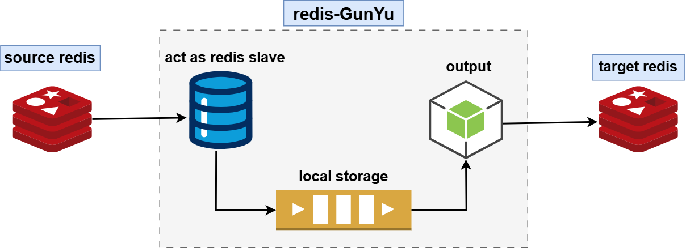

# Technical Principles

## Synchronization Principle

For each source Redis node, `redisGunYu` maintains a dedicated pipeline with the following structure:
- Input: Impersonates a Redis slave to synchronize data from the source Redis node.
- Channel: Local cache, currently only supports storage in the local file system.
- Output: Sends RDB and AOF data of the source Redis to the target Redis.

## High Availability Architecture

For each source Redis node, `redisGunYu` has a dedicated pipeline. Each pipeline independently elects a leader. The `redisGunYu` nodes form a P2P architecture, where they act as leader and follower for each other. The leader is elected based on the latest cached data and it impersonates a Redis slave to synchronize data from the source Redis node to the target node. Simultaneously, the data is sent to the followers. This P2P structure minimizes the impact of tool failures.
