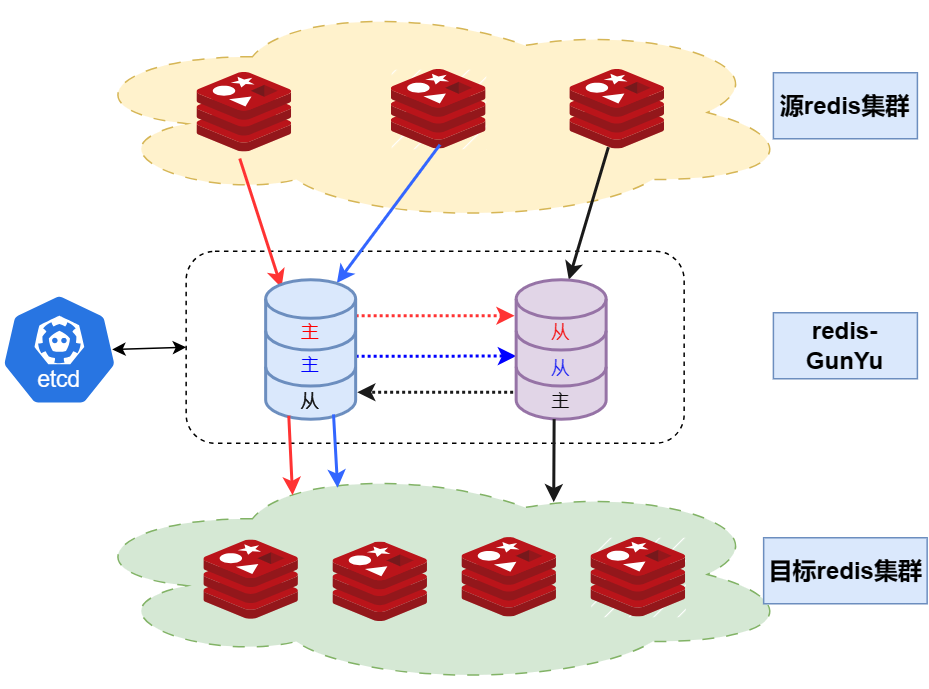

# 技术原理

## 同步原理

针对每一个源端redis的节点，`redisGunYu`都会有一条对应的pipeline，每条pipeline结构如下：
- 输入端：伪装成redis slave，从源端redis实例同步数据
- 通道端：本地缓存，现仅支持存储到本地文件系统
- 输出端：将同步的源端redis RDB和AOF数据写入到目标端

## 高可用架构

针对每一个源端redis的节点，`redisGunYu`都会有一条对应的pipeline，每个pipeline都会单独地选举leader，`redisGunYu`节点之间是P2P架构，互为主备，选举缓存数据最新的节点为leader，由leader伪装成redis slave从源端redis节点同步数据再写到目标端，同时将数据发送到follower。这种P2P结构，可以将工具本身故障的影响降到最低。

