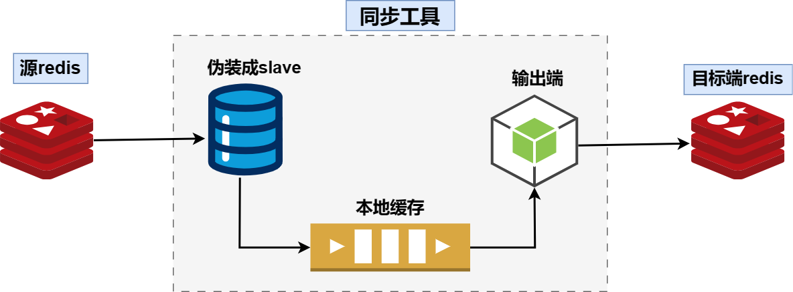
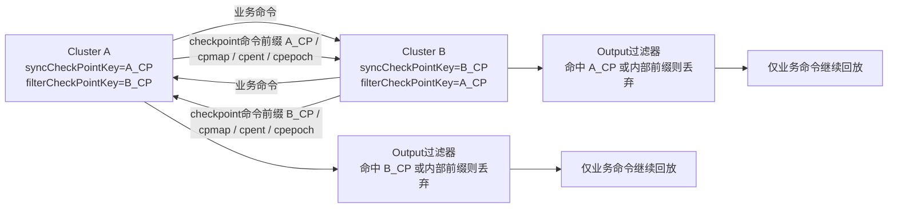
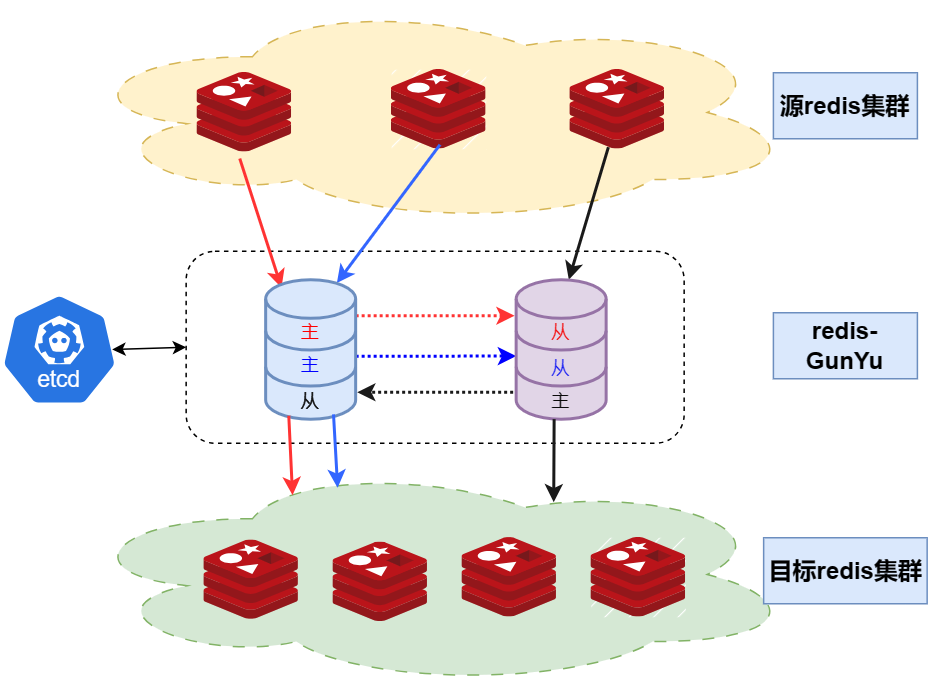

# 技术原理

## 同步原理

针对每一个源端redis的节点，`redisGunYu`都会有一条对应的pipeline，每条pipeline结构如下：
- 输入端：伪装成redis slave，从源端redis实例同步数据
- 通道端：本地缓存，现仅支持存储到本地文件系统
- 输出端：将同步的源端redis RDB和AOF数据写入到目标端

### 防回环过滤

双向同步时，对端实例写入的 checkpoint 命令会出现在本端复制流里；若不拦截，会被再次回放形成回环。程序通过 `syncCheckPointKey` + `filterCheckPointKey` + 内部前缀黑名单联合防护：

```mermaid
flowchart LR
  A[Cluster A<br/>syncCheckPointKey=A_CP<br/>filterCheckPointKey=B_CP]
  B[Cluster B<br/>syncCheckPointKey=B_CP<br/>filterCheckPointKey=A_CP]

  A -- 业务命令 --> B
  B -- 业务命令 --> A

  A -- checkpoint命令前缀 A_CP / cpmap / cpent / cpepoch --> B
  B -- checkpoint命令前缀 B_CP / cpmap / cpent / cpepoch --> A

  B --> BF[Output过滤器<br/>命中 A_CP 或内部前缀则丢弃]
  A --> AF[Output过滤器<br/>命中 B_CP 或内部前缀则丢弃]

  BF --> BOK[仅业务命令继续回放]
  AF --> AOK[仅业务命令继续回放]
```

- **`syncCheckPointKey`**：本实例 checkpoint 命名空间前缀。  
  在 cluster 模式下会结合 slot 维度生成/路由 checkpoint key（包括 slot-key 与分片 tag 体系），并非单一固定 key。

- **`filterCheckPointKey`**：回放过滤前缀。
  推荐双向交叉配置：A 侧 `filterCheckPointKey` 指向 B 侧 `syncCheckPointKey`，B 侧对称配置，用于过滤对端 checkpoint 写入。

- **固定内部守卫前缀**：`cpmap:{`、`cpent:{`、`cpepoch:{`。
  即使二者字符串不同，这三类内部 key 也会被直接过滤，避免漏网回环。

- **生效路径**：AOF（含脚本 key 参数检查、必要时事务整包丢弃）与 RDB 都会执行 checkpoint 相关过滤。

**配置要求**：`syncCheckPointKey` 与 `filterCheckPointKey` 必填，且必须使用非业务前缀；双向场景务必交叉配置，否则存在回环风险。

## 高可用架构

针对每一个源端redis的节点，`redisGunYu`都会有一条对应的pipeline，每个pipeline都会单独地选举leader，`redisGunYu`节点之间是P2P架构，互为主备，选举缓存数据最新的节点为leader，由leader伪装成redis slave从源端redis节点同步数据再写到目标端，同时将数据发送到follower。这种P2P结构，可以将工具本身故障的影响降到最低。

